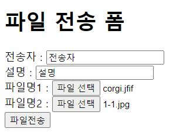
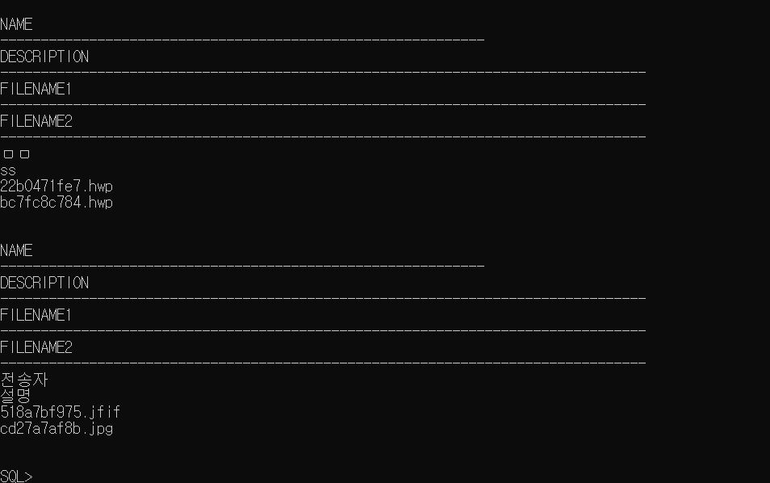

# Day 36 (Spring Boot)


### 프로젝트 생성

> 1. spring starter project
> 2. 프로젝트명
> 3. java8버전 맞춰준다
> 4. 패키지명 작성
> 5. Available: 맨아래 Web-spring web 선택


### setting

> * 처음 시작 프로젝트의 Myboot0Application
>
> ```java
> @SpringBootApplication //boot선언
> @ComponentScan(basePackageClasses = EmpMybatisController.class) //컨트롤러 인식
> @ComponentScan(basePackageClasses = UploadController.class) //uploadcontroller가 어딧는지 찾아주는 scan해서 찾아라, upload패키지의 컨트롤러만 인식한다
> @ComponentScan //()이 없으면 edu.spring.boot 패키지(현재 패키지)의 컨트롤러 인식
> @MapperScan(basePackageClasses = EmpDAO.class) //empdao클래스에서 메퍼 스캔해와 
> @MapperScan(basePackageClasses = UploadDAO.class)//uploaddao 클래스 메퍼 스캔해와
> ```
>
> 
>
> * src/main/resources/ application.properties
>
>   ```java
>   server.port=9001
>   # spring mvc project 워크스페이스(tomcat 실행) 동시 사용 불가
>         
>   #view resolver
>   #자바파일 src/main/java html파일 ===> src/main/resources/static
>   #jsp ===> src/main/webapp/
>   	      
>       #jsp 사용 설정
>   	spring.mvc.view.prefix=/WEB-INF/views/   //경로
>   	spring.mvc.view.suffix=.jsp  //확장자
>   	spring.devtools.livereload.enabled=true //	서버 자동 재시작 가능
>   	      
>   	#mybatis oracle datasource 만들기위한 설정
>   	spring.datasource.driver-class-name=oracle.jdbc.OracleDriver
>   	spring.datasource.url=jdbc:oracle:thin:@localhost:1521:xe
>   	spring.datasource.username=hr
>   	spring.datasource.password=hr
>         
>   	#config파일 알려줘야한다
>   	mybatis.config-location=classpath:mybatis/mybatis-config.xml
>   	
>   	
>   	#mapper파일 누군지 알려줘야 한다 (복수개)
>   	mybatis.mapper-locations=classpath:mybatis/mappers/*-mapping.xml
>   ```


### mybatis setting

> * pom.xml 따로 작성할필요없이 프로젝트 생성시 Available-SQL탭에서 
>
>   * Spring Data JDBC
>   * Mybatis Frameword
>   * Oracle Driver 
>
>   선택한다.


### mybatis 설정시 id = DAO 메소드명

> * EmpDAO에 들어가있는 emplist = sql-mapping에 id=emplist를 받아오게 할거다.
>* sql-mapping id로 바꿀거다 = emplist안의 정보들을 받아온다.
> * @Mapper 아이디가 똑같은 것들을 매핑하겠다
>* **중요한것 :**  
> 
>  * **@mapper ** =EmpDAO를 매퍼로 할게
>   * **메서드이름(emplist)** 
>  *  **namespace="xxx.DAO"** 
>   * **select id="emplist"** 
> * ServiceImple 의 return 의 메소드명도 바꿔줘야한다.
> 

------------


### Upload 실습 (문제)

##### files 테이블 생성

> create table files
> ( name varchar2( 30),
> description varchar2(2000),
> filename 1 varchar2(100),
> filename2 varchar2(100) );


##### UploadVO 객체 추가

> filename1 setter / getter 메소드
> filename2 setter / getter 메소드


##### UploadController 수정

> ```java
> @RequestMapping(value="/fileupload", method=RequestMethod.POST)
> 	public String uploadResult(@ModelAttribute("vo") UploadVO vo) throws IOException{
> ```
>
> + mybatis 이용해서 files 테이블에 저장
>
> * UploadVO(name, description, filename1, filename2)  
>   * filename은 UUID로 변환된값


##### UploadService, UploadServiceImpl 생성

> 메소드 ( 변수) 설정


##### UploadDAO  생성

> * @Mapper 
> * Interface
> * 메소드 선언부 = mapping id


##### src/main/resources/mybatis/mappers/upload-mapping.xml

> ```javascript
> <?xml version="1.0" encoding="UTF-8" ?>
> <!DOCTYPE mapper PUBLIC "-//mybatis.org//DTD Mapper 3.0//EN"
> "http://mybatis.org/dtd/mybatis-3-mapper.dtd">
> <mapper namespace="upload.UploadDAO" >
> <!--구현 --->
> <mapper>
> ```


##### mybatis-config.xml  <typealias type 추가

> ```javascript
> <typeAliases>
> <typeAlias type="upload.UploadVO" alias="upVo"/>
> </typeAliases>
> ```


----------------

### Upload 실습(풀이)

##### UploadVO

```java
public class UploadVO {
//전송자이름, 설명, 파일 2개 전송--> 4개 INPUT  JSP
	String name;
	String description;
	MultipartFile file1;
	MultipartFile file2;
	String filename1;
	String filename2;
	
	public UploadVO() {}
	
	public UploadVO(String name, String description, String filename1, String filename2) {
		super();
		this.name = name;
		this.description = description;
		this.filename1 = filename1;
		this.filename2 = filename2;
        
        
       	public String getFilename1() {
		return filename1;
	}
	public void setFilename1(String filename1) {
		this.filename1 = filename1;
	}
	public String getFilename2() {
		return filename2;
	}
	public void setFilename2(String filename2) {
		this.filename2 = filename2;
	}
```

> * UUID 로 변환되는 파일명을 받아오기위해 VO에서 String filename1,2 를 생성
> * UploadVO 기본생성자 + (name, description, filename1, filename2 ) 생성자 생성
> * filename1,2 의 getter/setter 생성


##### UploadController

```java
package upload;
import java.io.File;
import java.io.IOException;
import java.util.UUID;

import org.springframework.beans.factory.annotation.Autowired;
//<context>cpn... base=p..="upload"
import org.springframework.stereotype.Controller;
import org.springframework.web.bind.annotation.ModelAttribute;
import org.springframework.web.bind.annotation.RequestMapping;
import org.springframework.web.bind.annotation.RequestMethod;
import org.springframework.web.multipart.MultipartFile;

@Controller
public class UploadController {
	//uploadservice를 받아오는 autowired선언, service명이 중복되면 충돌난다
    @Autowired
	UploadService Upservice;
	//파일 업로드 화면 출력
	@RequestMapping(value="/fileupload", method=RequestMethod.GET)
	public String uploadForm() {
		return "/upload/uploadform";
	}
    //파일 업로드 전송 설정 + 난수로 파일명 변환 + vo에 입력값들 저장
	@RequestMapping(value="/fileupload", method=RequestMethod.POST)
	public String uploadResult(@ModelAttribute("vo") UploadVO vo) throws IOException{

		//전송 파일 2개 객체 생성
		MultipartFile multi1 = vo.getFile1();
		MultipartFile multi2 = vo.getFile2();
		//파일명 추출
		String filename1 = multi1.getOriginalFilename();
		String filename2 = multi2.getOriginalFilename();
		
		//서버 c:/kdigital2/upload 폴더 저장
		String savePath = "c:/kdigital2/upload/";

		//확장자 uuid로 파일명 난수 저장 
		String ext1 = filename1.substring(filename1.lastIndexOf("."));
		String ext2 = filename2.substring(filename2.lastIndexOf("."));
		
		filename1 = getUuid()+ext1;
		filename2 = getUuid()+ext2;
		
		
		File file1 = new File(savePath + filename1);
		File file2 = new File(savePath + filename2);	
		
		//저장
		multi1.transferTo(file1);
		multi2.transferTo(file2);
		
        //set.Filename의 매개변수는 vo.get이 아니라 난수가 삽입된 	 filename1=getUuid()+ext1; 을 넣어줘야한다.
        //vo에 매개변수값들 저장
		vo.setName(vo.getName());
		vo.setDescription(vo.getDescription());
		vo.setFilename1(filename1);
		vo.setFilename2(filename2);
		
        //Upservice에 insertDate(저장된vo) 매소드 저장
		Upservice.insertData(vo);
		
		

		return "/upload/uploadresult";//${vo.file1}
		
	}//uploadResult end

	public static String getUuid() {
		return UUID.randomUUID().toString().replaceAll("-", "").substring(0, 10);
	}
```

> ##### keypoint
>
> * set.Filename의 매개변수는 vo.get이 아니라 난수가 삽입된 	 filename1=getUuid()+ext1; 을 넣어줘야한다.
> * <span style="color:red">modelandview가 없어도 vo에 입력값 저장- service 로 전달 한다</span>


##### upload-mapping.xml

```javascript
<mapper namespace="upload.UploadDAO" >

<insert id="insertdata" parameterType="upVo">
insert into files(name, description, filename1, filename2 ) 
values(#{name} , #{description} , #{filename1} , #{filename2} )
</insert>
```

> * 입력값을 읽어오는 변수는 $가 아니라 #임을 명심하자


##### UploadDAO

```java
package upload;

import java.util.List;
import org.apache.ibatis.annotations.Mapper;
import org.springframework.stereotype.Repository;

@Mapper
@Repository
public interface UploadDAO {
		
	public void insertdata(UploadVO vo);
	
}
```

> * @Mapper 선언
> * @Repository 선언
> * interface 타입
> * 메소드명 public void insertdata(UploadVO vo); ==
> * mapping.xml 의 <insert id="insertdata" 와 같게한다.


##### UploadService , UploadServiceImple

```java
public interface UploadService {
		public void insertData(UploadVO vo);		
}

@Service("Upservice")
public class UploadServiceImpl implements UploadService {
	@Autowired
	UploadDAO dao;
	
	@Override
	public void insertData(UploadVO vo) {
		dao.insertdata(vo);
		
	}

}
```

> * @Service(" ") 이 안의 값은 다른값과 충돌이 날 수 있으므로 Upservice라고 선언해줘야한다.
>
> * DAO @Autowired로 읽어온다
>
> * 	public void insertData(UploadVO vo) {
>     		dao.insertdata(vo);

> ​		DAO와 같이 dao.메소드명을 맞춰준다


#### 어려웠던점

> * @Service("service") sts와 다르게 boot에서는 service 명이 같으면 충돌이 나서 오류가 발생하므로 꼭 내부 service를 각기 다른걸로 선언해줘야한다
> * MVC를 사용하는줄 알고 insert는 void타입인데 addObject('name', 'object') 할때 오류나서 계속 헤맸다. 
> * ==> 결론은 modelandview 안쓰고 @ModelAttribute를 이용해서 값을 삽입할수 있었다.
>
> ```java
> 		vo.setName(vo.getName());
> 		vo.setDescription(vo.getDescription());
> 		vo.setFilename1(filename1);
> 		vo.setFilename2(filename2);
> 
> 		Upservice.insertData(vo);
> ```
>
> * 따로 UploadVO vo= new UploadVO(); 를 사용하지 않아도 vo에 웹에서 읽어온 parameter값들이 쏙 들어가서 저장됐고, 그걸 Upservice로 저장 할 수 있었다.
> * mapping.xml 에서 계속 missing comma 오류가 나서 눈이 빠져라 확인했지만 틀린문장은 없었다 
> * ==> 멍청하게 jsp 마냥 ${} 를 사용했다. xml에서는 #{} 를 잊지말자.


### 저장결과 






